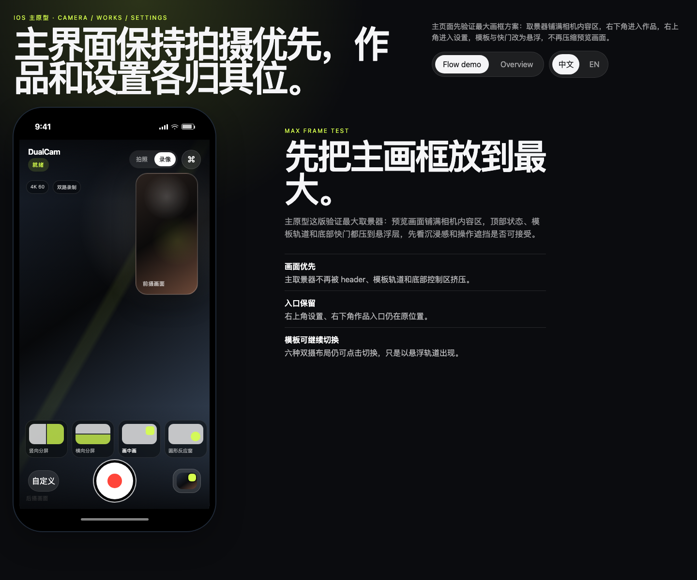
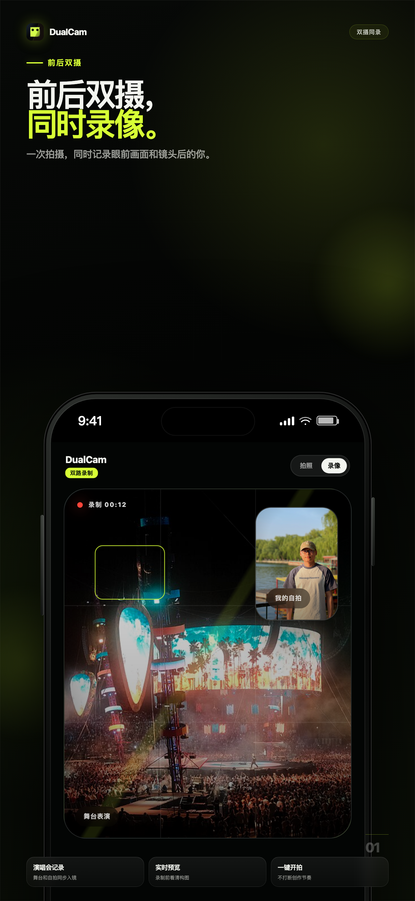
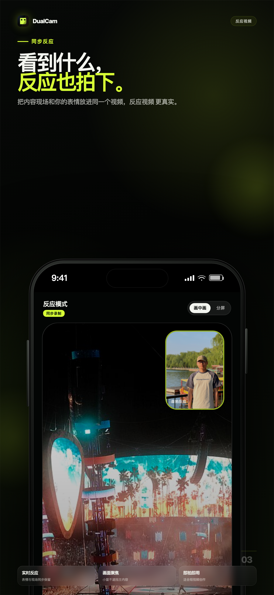
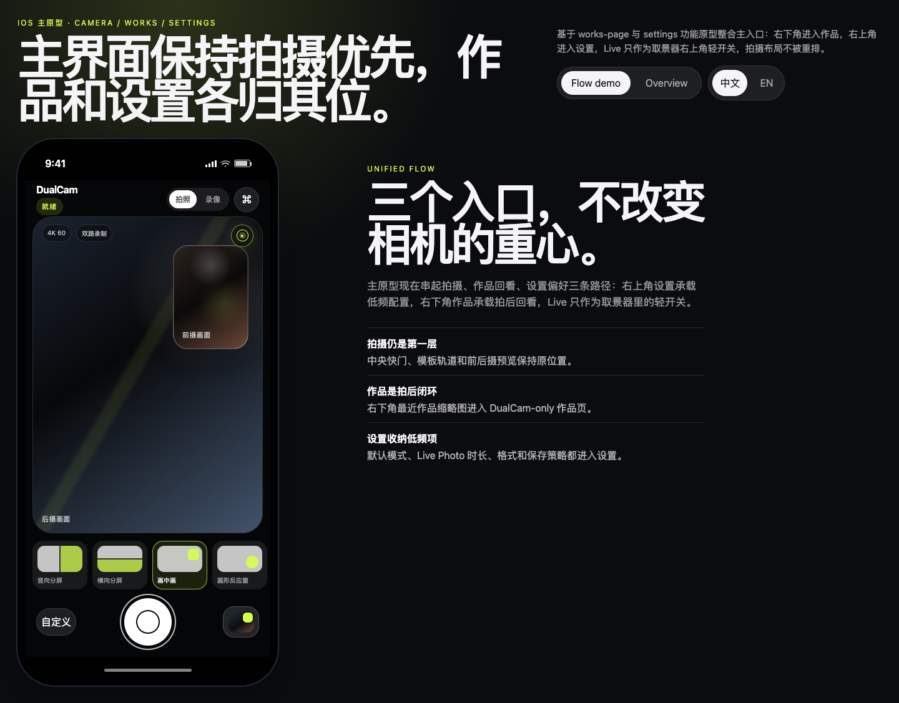

# DualCam 双摄录像 · 使用指南

> 配合 [`prototype.html`](prototype.html) 使用，可以直接体验六种布局切换、录制状态和双摄预览结构。

  

## 看图快速上手

  
  
  

1. 打开 App 后先确认前后画面是否都已出现。
2. 在底部布局栏选择构图模板。
3. 点击快门开始录制。
4. 录制中可继续切换布局或调整前置小窗。
5. 再次点击快门停止，视频会保存到系统相册。

## 开始前检查

| 检查项 | 说明 |
| --- | --- |
| 真机 | 双摄同步采集需要支持多摄的 iPhone，Simulator 只能做 UI 和编译检查 |
| 权限 | 首次启动需要允许相机、麦克风和添加到照片图库 |
| 存储 | 长时间录制前确认剩余空间充足 |
| 电量和温度 | 双摄录制会持续调用相机和编码器，建议避免低电量长时间拍摄 |

## 主界面说明

### 取景器

后置画面默认作为现场主视角，前置画面用于记录讲述者或 reaction。布局切换会同时影响实时预览和最终视频合成效果。

### 顶部控制

| 控制 | 用途 |
| --- | --- |
| 闪光灯 | 控制后置摄像头补光 |
| 设置 | 查看语言、权限、录制偏好等设置 |
| 状态提示 | 显示 ready / recording / 权限异常等状态 |

### 底部控制

| 控制 | 用途 |
| --- | --- |
| 布局栏 | 横向选择六种布局模板 |
| 快门 | 开始或停止录制。录制中按钮会变成停止形态 |
| 切换 | 调整前后画面的主次关系 |
| 相册 | 查看已保存作品 |

## 六种布局

| 布局 | 适合场景 | 操作提示 |
| --- | --- | --- |
| 画中画 | 记录现场同时保留 reaction | 拖动前置小窗到不遮挡主体的位置 |
| 左右分屏 | 对话、对比、评测 | 保持两边主体都在画面中心附近 |
| 上下分屏 | 竖屏分镜、教程说明 | 适合一边展示现场，一边展示讲述者 |
| 对角布局 | 需要更强视觉张力的双现场 | 适合短视频开场或转场镜头 |
| 后置主屏 | 以后置现场为主 | 前置画面用于补充表情和解说 |
| 前置主屏 | 以讲述者为主 | 后置画面作为现场证据或环境补充 |

## 录制流程

### 标准录制

1. 选择布局。
2. 检查前后摄像头预览。
3. 点击快门开始录制。
4. 录制中观察状态提示和时间码。
5. 再次点击快门停止录制。
6. 等待保存完成后，到系统相册或 App 作品页查看。

### 调整前置小窗

- 在画中画、后置主屏等布局中，按住前置小窗拖动。
- 尽量避开人物脸部、字幕区域和核心拍摄对象。
- 录制中调整会影响后续合成画面。

### 录制中切换布局

- 点击底部布局栏即可切换。
- 切换不会中断录制。
- 最终视频会按录制过程中的布局状态持续合成。

## 技术规格

| 项目 | 规格 |
| --- | --- |
| 最低系统版本 | iOS 15.0+ |
| 视频分辨率 | 1080p（1920×1080） |
| 帧率 | 30fps |
| 视频编码 | H.264 MP4 |
| 音频 | AAC |
| 保存位置 | 系统相册 |
| 关键框架 | SwiftUI / AVFoundation / Photos |

## 常见问题

### Simulator 里为什么看不到真实双摄？

Simulator 没有真实相机硬件，不能验证 `AVCaptureMultiCamSession` 的实际采集行为。需要连接 iPhone 真机测试前后摄像头、麦克风、闪光灯和相册保存。

### 录制失败怎么办？

先检查系统权限，再确认设备是否支持多摄同步。仍然失败时，重启 App 并查看设置页或错误提示。

### 为什么文档里有 `prototype.html` 和 `promo-video.html`？

`prototype.html` 用来评审交互和界面结构；`promo-video.html` 是推荐视频的 HTML 源文件，可渲染生成 `promo-preview.gif`，供 README 和分享物料使用。
